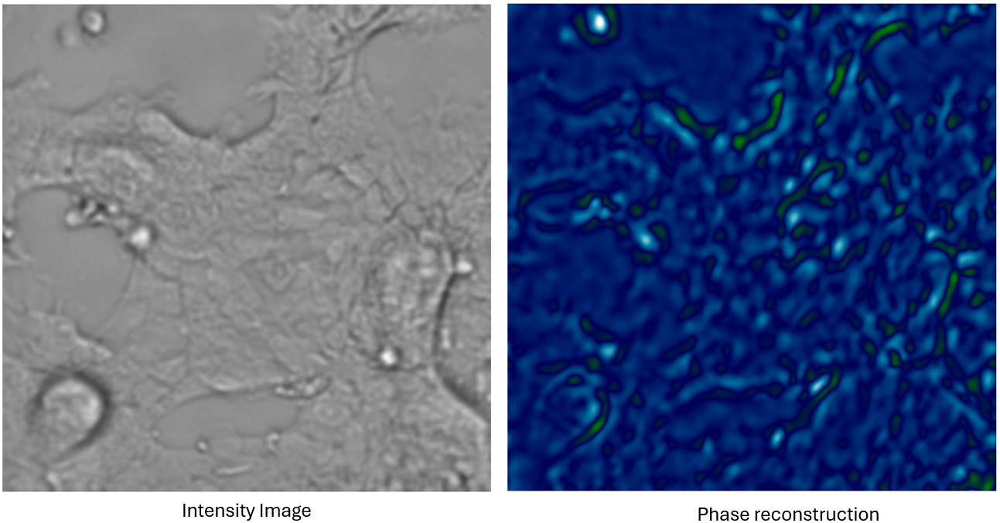

# Matrix Solution (MS-TIE)
GPU-optimized iterative phase retrieval method based on the TIE, called Matrix Solution to the TIE (MS-TIE)

This project contains the Python implementation of the MS-TIE phase retrieval method, and it also compares this method with other state-of-the-art techniques. Python implementations of all these methods are provided.

In the `src/` folder, you will find the notebooks with simulations and experiments. It is highly recommended to follow the **Recommendations** and **Instructions** below.

---
## Paper

**Related Reference:** "GPU-optimized Matrix Method for Phase Retrieval with the Transport of Intensity Equation" Alejandro Silva and Julia Alonso.

---
## Recommendations

- It is strongly recommended to run this on *Google Colab*
- In general, two images are used to estimate the axial derivative.
- Sometimes could be necessary running the code twice to avoid delays in the GPU connection.
- Do not forget to modify the `path_repo` variable when using the notebooks.
- If you use this repository, please do not forget to cite our work as mentioned above.

---

## Resume

The development of the notebooks was designed for execution in *Google Colab*. In particular, the CuPy Python package is used for the implementation of the algorithms. We used a  NVIDIA Tesla T4 GPU.

Each notebook contains the Python implementation of the following phase retrieval methods:

  - FFT solution [1]
  - iterDCT method [32]
  - Universal Solution (US)  [3]
  - Matrix Solution (MS) (our)

[1] D. Paganin and K. A. Nugent, “Noninterferometric phase imaging with partially coherent light,” Phys. review letters 80, 2586 (1998).
[2] L. Huang, C. Zuo, M. Idir, W. Qu, and A. Asundi, “Phase retrieval with the transport-of-intensity equation in an arbitrarily shaped aperture by iterative discrete cosine transforms,” Opt. letters 40, 1976–1979 (2015).
[3]  J. Zhang, Q. Chen, J. Sun, L. Tian, and C. Zuo, “On a universal solution to the transport-of-intensity equation,” Opt. Lett. 45, 3649–3652 (2020).

---
## Instructions

To use the notebooks:
- We recommend downloading the code as a zip file.
- Unzip the content.
- Upload the folder to Google Drive, maintaining the folder structure.
- IMPORTANT: Modify the `path_repo` variable.

After that, you can execute the notebooks. Don't forget the recommendations mentioned earlier.

---
## Contact

Alejandro Silva 

You can reach me at: [asilva@fing.edu.uy](mailto:asilva@fing.edu.uy)

Feel free to reach out if you have any questions or feedback!
